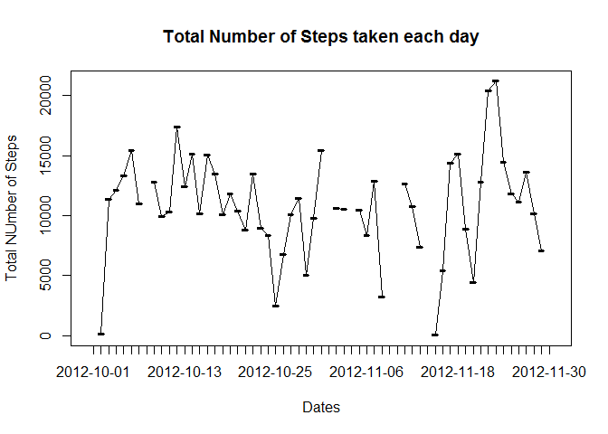
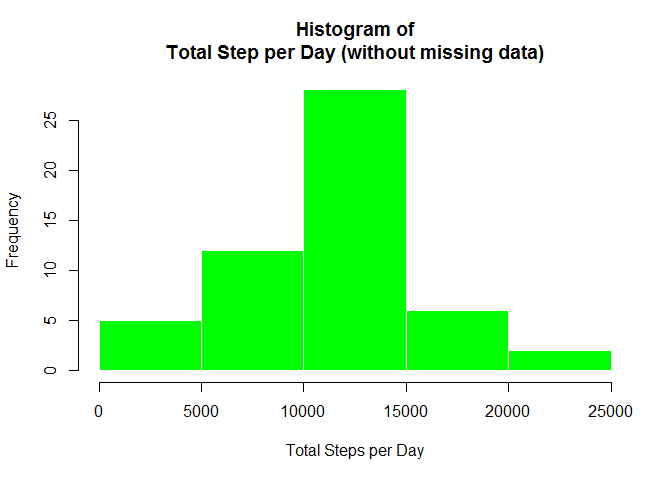
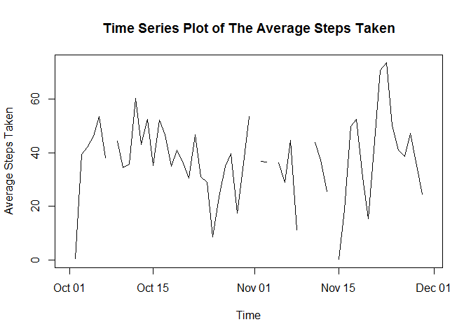
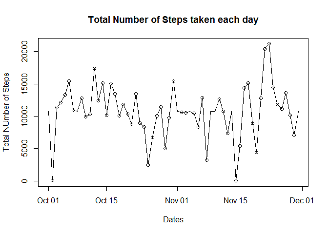
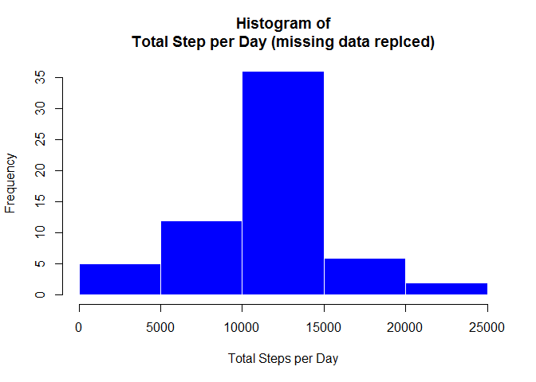
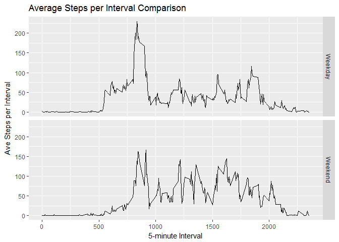

Reproducible Research - Assignment 1
====================================

Loading and preprocessing the data
----------------------------------

    library(dplyr)

    ## Warning: package 'dplyr' was built under R version 3.3.2

    ## 
    ## Attaching package: 'dplyr'

    ## The following objects are masked from 'package:stats':
    ## 
    ##     filter, lag

    ## The following objects are masked from 'package:base':
    ## 
    ##     intersect, setdiff, setequal, union

    library(ggplot2)

    ## Warning: package 'ggplot2' was built under R version 3.3.2

    raw_data <- read.csv("../../workingdir/activity_data/activity.csv", header = TRUE, sep = ",")

    head(raw_data)

    ##   steps       date interval
    ## 1    NA 2012-10-01        0
    ## 2    NA 2012-10-01        5
    ## 3    NA 2012-10-01       10
    ## 4    NA 2012-10-01       15
    ## 5    NA 2012-10-01       20
    ## 6    NA 2012-10-01       25

    str(raw_data)

    ## 'data.frame':    17568 obs. of  3 variables:
    ##  $ steps   : int  NA NA NA NA NA NA NA NA NA NA ...
    ##  $ date    : Factor w/ 61 levels "2012-10-01","2012-10-02",..: 1 1 1 1 1 1 1 1 1 1 ...
    ##  $ interval: int  0 5 10 15 20 25 30 35 40 45 ...

What is mean total number of steps taken per day?
-------------------------------------------------

The total number of steps taken by the subject per day:

    daily_totals <- aggregate(steps ~ date, raw_data, sum, na.action = na.pass)

    plot(daily_totals$date,daily_totals$steps, xlab="Dates", ylab="Total NUmber of Steps", main="Total Number of Steps taken each day")
    lines(daily_totals$date,daily_totals$steps)

    hist(daily_totals$steps, main="Histogram of\nTotal Step per Day (without missing data)", xlab="Total Steps per Day", col = "green", border = "white")

The Mean and Median of the Daily Steps Total will need to be calculated
after the "NA" values are removed.

    mean(daily_totals$steps, na.rm = TRUE)

    ## [1] 10766.19

    median(daily_totals$steps, na.rm = TRUE)

    ## [1] 10765

What is the average daily activity pattern?
-------------------------------------------

    raw_data$date <- as.Date(raw_data$date)
    summary.dat <- group_by(raw_data,date) 
    summary.dat <- summarise(summary.dat, Mean=mean(steps),Median=median(steps),Min=min(steps),Max=max(steps))

    summary.dat <- cbind(summary.dat,total_steps=daily_totals$steps)

    plot(summary.dat$date,summary.dat$Mean, type = "l", 
         main = "Time Series Plot of The Average Steps Taken", 
         xlab = "Time", ylab = "Average Steps Taken", col="red")
    lines(summary.dat$date,summary.dat$Mean)

The 5-minute interval, on average across all the days in the dataset,
that contains the maximum number of steps is:

    ave <- aggregate(x = list(steps = raw_data$steps), by = list(interval = raw_data$interval), FUN = mean, na.rm = TRUE)

    print("The maximum number of steps on average occured on the following Interval:")

    ## [1] "The maximum number of steps on average occured on the following Interval:"

    ave[which.max(ave$steps),]

    ##     interval    steps
    ## 104      835 206.1698

Imputing missing values
-----------------------

Just like in any real world data, there will be cases where values are
missing. We have to handle these situation by filling in the missing
data in a logical way. In the case of this assignment, it seems most
appropriate if the missing data for a particular interval is replaced by
the average (mean) value for that interval

    imp_data <- raw_data

    print("Number of Rows with missing data:")

    ## [1] "Number of Rows with missing data:"

    sum(is.na(imp_data$steps))

    ## [1] 2304

Replacement of missing values with the Mean value for that respective
interval

    for (i in 1:nrow(imp_data)){
      if (is.na(imp_data[i,1])) {
        imp_data[i,1] <- ave[ave$interval==imp_data[i,3],2]
      }
    }

Now we can compare the data before and after the imputing of missing
data

    imp_totals <- aggregate(steps ~ date, imp_data, sum, na.action = na.pass)

    plot(imp_totals$date,daily_totals$steps, xlab="Dates", ylab="Total NUmber of Steps", main="Total Number of Steps taken each day")
    lines(imp_totals$date,imp_totals$steps)

    hist(imp_totals$steps, main="Histogram of\nTotal Step per Day (missing data replced)", xlab="Total Steps per Day", col = "blue", border = "white")

Are there differences in activity patterns between weekdays and weekends?
-------------------------------------------------------------------------

Now we segment the data between the Weekdays and Weekends; to determine
if there is a difference in activity levels between the two time
periods.

    imp_data$date <- as.Date(imp_data$date)
    imp_data$daytype <- ""
    for (i in 1:nrow(imp_data)){
      day <- weekdays(imp_data$date[i])
      if (day %in% c("Monday", "Tuesday", "Wednesday", "Thursday", "Friday")) {
        imp_data$daytype[i] <- "Weekday"
        }
      else if (day %in% c("Saturday", "Sunday")){
        imp_data$daytype[i] <- "Weekend"
        }
      else stop("Invalid Date")
    }

Now we calculate the average steps for each interval

    imp_ave <- aggregate(steps ~ interval + daytype, data = imp_data, mean)

Let's see what the plot of the average steps taken in each interval
across the weekdays and weekends.

    grph <- ggplot(imp_ave, aes(x=interval, y=steps))
    grph <- grph + geom_line()
    grph <- grph + facet_grid(daytype ~ .)
    grph <- grph + labs(x="5-minute Interval", y="Ave Steps per Interval")
    grph <- grph + labs(title="Average Steps per Interval Comparison")

    print(grph)

### Based on the comparison of average steps taken for each interval across Weekdays and Weekends, it appears that the **activity level of our subject is higher throughout the weekends.**
